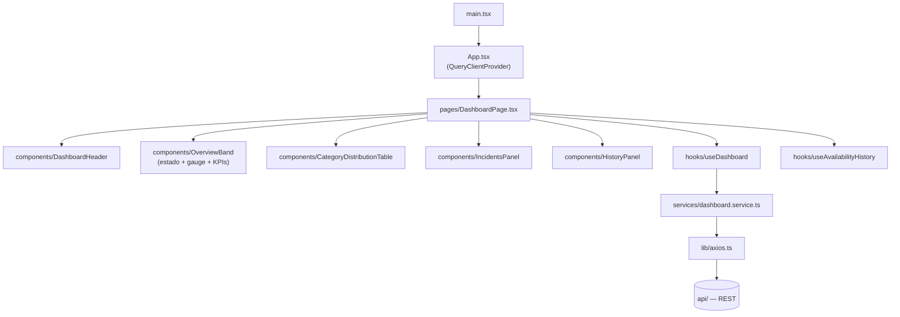

# Buni API Hub — Dashboard

Frontend React/TypeScript/Vite independente do Painel Operacional (NOC): tela cheia, tema escuro, pensada para ficar aberta permanentemente numa TV/monitor de operação, com atualização automática a cada 30s.

> Repositório: `buni-hub-dashboard` · Parte do ecossistema **Buni API Hub** (`api/` — backend). Não depende de `web/` nem de `ingestion/` — consome exclusivamente a API REST via HTTP.

---

## Sumário

- [Visão geral](#visão-geral)
- [Objetivo](#objetivo)
- [Arquitetura](#arquitetura)
- [Stack tecnológica](#stack-tecnológica)
- [Estrutura de diretórios](#estrutura-de-diretórios)
- [Endpoints consumidos](#endpoints-consumidos)
- [Fluxo dos Dados](#fluxo-dos-dados)
- [Dependência exclusiva da API](#dependência-exclusiva-da-api)
- [Variáveis de ambiente](#variáveis-de-ambiente)
- [Como executar localmente](#como-executar-localmente)
- [Build e deploy](#build-e-deploy)
- [Licença](#licença)

---

## Visão geral

Este projeto nasceu como uma extração de `web/` (o Portal de Serviços): originalmente o Painel Operacional era uma feature dentro do Portal; depois que o Portal ganhou um CRUD completo próprio, os dois produtos passaram a ter públicos e ritmos de deploy diferentes o suficiente para justificar frontends independentes, ambos consumindo a mesma API REST sem qualquer mudança nela.

O `dashboard/` é **só** o Painel Operacional — não tem rotas, não tem CRUD, não tem navegação institucional (Header/Sidebar/Footer), não tem favoritos nem formulários. É uma aplicação de monitoramento, não uma tela administrativa: sua única responsabilidade é consumir a API e apresentar o estado operacional do ambiente. Identidade visual própria, inspirada (sem copiar layout) em ferramentas corporativas de monitoramento como Azure Monitor, Grafana, Datadog e Dynatrace — paleta escura discreta, hierarquia por camadas, sem gradientes ou cores vibrantes. Pensado para ficar aberto continuamente em **TVs corporativas, salas de monitoramento e centros de operação (NOC)**.

**Responsabilidade do Dashboard:**

- Monitoramento contínuo do ambiente.
- Indicadores consolidados (Online/Offline/Em Manutenção/Desconhecidos/Total).
- Disponibilidade geral e tendência da sessão.
- Recursos que exigem atenção (incidentes).
- Atualização automática (polling de 30s), sem qualquer ação do usuário.

**O que o Dashboard explicitamente não faz:**

- **Não realiza cadastro.**
- **Não realiza edição.**
- **Não realiza exclusão.**
- **Não possui persistência própria** — o único estado mantido em memória (`useAvailabilityHistory`) é um histórico de sessão, perdido a cada reload, nunca gravado em disco/`localStorage`/banco.

Layout fixo em `h-screen`, sem rolagem em nenhuma dimensão — requisito obrigatório para exibição contínua em TV Full HD. Hierarquia de leitura (de cima para baixo — um operador deve entender a situação da plataforma em até 5 segundos), cada dado em exatamente um componente:

1. **Estado Geral + Disponibilidade + Indicadores Principais** — faixa única (`OverviewBand`): veredito (operacional/incidente), gauge de disponibilidade e os 5 KPIs (Total/Online/Offline/Manutenção/Desconhecidos), lidos em conjunto.
2. **Distribuição por Categoria** — qual categoria (API/Web Service/Site) foi impactada, em formato de tabela compacta (`CategoryDistributionTable`).
3. **Recursos que Exigem Atenção** — o principal componente operacional, limitado a um número fixo de linhas visíveis para nunca depender de rolagem (`IncidentsPanel`).
4. **Histórico de Disponibilidade** — tendência da sessão, painel pequeno e complementar ao gauge (`HistoryPanel`).

## Objetivo

Dar à equipe de operações uma tela única, sempre atualizada, que responda "existe algo fora do ar agora?" em poucos segundos — sem exigir login, sem navegação, sem depender do Portal de Serviços estar aberto.

## Arquitetura

Projeto de página única (sem `react-router`): `main.tsx` monta `App.tsx`, que só provê `QueryClientProvider` e renderiza `DashboardPage` diretamente.



Todo componente visual usa a paleta escura própria (`constants/index.ts` → `DASHBOARD_COLORS`/`STATUS_CONFIG`) via `style` inline — não há tema de marca do Portal aqui; o Tailwind é usado só para utilitários de layout (`flex`, `rounded-xl`, `font-mono` etc.), sem tokens customizados.

## Stack tecnológica

| Categoria | Tecnologia |
|---|---|
| Framework UI | React ^19.2 |
| Linguagem | TypeScript ~6.0 (`strict`) |
| Build tool | Vite ^8.1 (`@vitejs/plugin-react`) |
| Estado de servidor / cache | TanStack Query ^5.101 (+ Devtools em dev) |
| HTTP client | Axios ^1.18 |
| Estilo | Tailwind CSS ^4.3 (`@tailwindcss/vite`, sem tema customizado) |
| Validação de env | Zod ^4.4 |
| Lint/format | ESLint 10 (flat config) + Prettier (`prettier-plugin-tailwindcss`) |

Não há framework de testes configurado (sem Vitest/Testing Library) e não há `react-router` — é uma página única.

## Estrutura de diretórios

```
dashboard/
├── public/
│   └── favicon.svg
├── src/
│   ├── assets/
│   │   ├── images/                 # logo institucional
│   │   └── styles/index.css        # `@import 'tailwindcss';`, sem tema
│   ├── components/                 # componentes visuais do Painel + ícones locais
│   ├── hooks/                      # useDashboard, useClock, useCountUp, useAvailabilityHistory
│   ├── pages/
│   │   └── DashboardPage.tsx       # única página da aplicação
│   ├── services/
│   │   └── dashboard.service.ts    # getDashboard() — GET /dashboard
│   ├── types/                      # DashboardSummary/Incident/Response + ResourceType/ResourceEnvironment
│   ├── utils/
│   │   └── formatElapsed.ts
│   ├── constants/                  # paleta escura, status, rótulos de tipo/ambiente
│   ├── lib/                        # axios.ts, apiErrorMessage.ts, httpStatusMessages.ts, errors.ts, queryClient.ts
│   ├── config/
│   │   └── env.ts                  # validação Zod de VITE_API_BASE_URL
│   ├── App.tsx
│   ├── main.tsx
│   └── vite-env.d.ts
├── vite.config.ts
├── eslint.config.js
├── tsconfig.json / tsconfig.app.json / tsconfig.node.json
├── .env.example
└── package.json
```

## Endpoints consumidos

Todos servidos pela `api/`, sem nenhum endpoint novo ou alterado por conta deste projeto:

| Método | Rota | Uso neste projeto |
|---|---|---|
| `GET` | `/dashboard` | Consumido por `useDashboard()` — `{ summary, incidents }` combinados, com polling de 30s |

`/dashboard/summary` e `/dashboard/incidents` também existem na API (consumo isolado de cada parte), mas este projeto usa a rota combinada `/dashboard` para uma única requisição por ciclo de polling.

## Fluxo dos Dados

```
Usuário
   ↓
dashboard (React)
   ↓
API REST
   ↓
/dashboard, /dashboard/summary, /dashboard/incidents
```

1. `DashboardPage` monta e `useDashboard()` dispara a primeira busca via `services/dashboard.service.ts`.
2. `services/dashboard.service.ts` chama `GET /dashboard` através da instância Axios (`lib/axios.ts`).
3. A resposta popula os componentes visuais (métricas, disponibilidade, gráficos, incidentes).
4. `refetchInterval: 30_000` (com `refetchIntervalInBackground: true`) repete o ciclo indefinidamente, sem ação do usuário — é o próprio requisito do modo TV.

## Dependência exclusiva da API

Este projeto **não importa nada** de `web/` nem de `api/` — todo o código de que precisava (Logo, ícones de tipo de recurso, rótulos, tratamento de erro HTTP, instância Axios) foi copiado para dentro de `dashboard/src/`, não referenciado por caminho relativo entre pastas. A única integração com o resto do ecossistema é HTTP, via `VITE_API_BASE_URL`. Isso é intencional: o projeto está pronto para virar um repositório próprio (`buni-hub-dashboard`) e ter deploy independente, sem qualquer acoplamento de build com `web/` ou `api/`.

Documentação completa do monitoramento em si (classificação de status, agendamento do health check, limitações conhecidas) está em **[`api/docs/dashboard-operacional.md`](../api/docs/dashboard-operacional.md)** — não duplicada aqui.

## Variáveis de ambiente

| Variável | Obrigatória | Default | Descrição |
|---|---|---|---|
| `VITE_API_BASE_URL` | Não | `http://localhost:3333` | URL base da API consumida pelo Painel |

Validada via Zod em `config/env.ts` — falha rápida (erro fatal com mensagem detalhada) se definida com um valor que não seja uma URL válida.

## Como executar localmente

Pré-requisitos: Node.js compatível com Vite 8/TypeScript 6, npm, e a API (`api/`) rodando (local ou remota).

```bash
cd dashboard
cp .env.example .env       # ajuste VITE_API_BASE_URL para sua API local, se necessário
npm install
npm run dev                 # Vite dev server
```

Outros scripts:

```bash
npm run typecheck    # tsc -b --noEmit
npm run lint          # eslint .
npm run lint:fix
npm run format        # prettier --write .
npm run preview        # serve o build de produção localmente
```

Não há suíte de testes automatizados configurada.

## Build e deploy

```bash
npm run build   # tsc -b (typecheck) + vite build → dist/
```

O resultado é um conjunto de arquivos estáticos (`dist/`) — qualquer servidor de arquivos estáticos ou CDN serve a aplicação. Como é uma página única sem rotas, não há necessidade de configuração de SPA fallback.

Não há pipeline de CI/CD, Dockerfile ou configuração de deploy versionada neste repositório. Pensado para deploy independente de `web/` e `api/` — inclusive em domínios/subdomínios diferentes, já que a única dependência é a URL da API via `VITE_API_BASE_URL`.

## Licença

Não há arquivo de licença (`LICENSE`) neste repositório. Projeto proprietário/interno — uso restrito à organização, salvo indicação contrária de quem administra o repositório.
