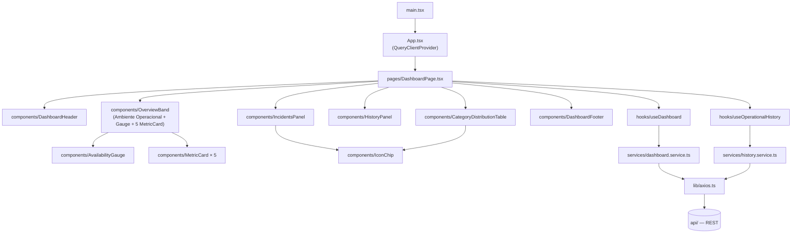

# Buni API Hub — Dashboard

Frontend React/TypeScript/Vite independente do Painel Operacional (NOC): tela cheia, tema escuro, pensada para ficar aberta permanentemente numa TV/monitor de operação, com atualização automática a cada 30s.

> Repositório: `buni-hub-dashboard` · Parte do ecossistema **Buni API Hub** (`api/` — backend). Não depende de `web/` nem de `ingestion/` — consome exclusivamente a API REST via HTTP.

---

## Sumário

- [Visão geral](#visão-geral)
- [Objetivo](#objetivo)
- [Componentes do Dashboard](#componentes-do-dashboard)
- [Arquitetura](#arquitetura)
- [Stack tecnológica](#stack-tecnológica)
- [Estrutura de diretórios](#estrutura-de-diretórios)
- [Endpoints consumidos](#endpoints-consumidos)
- [Fluxo dos Dados](#fluxo-dos-dados)
- [Dependência exclusiva da API](#dependência-exclusiva-da-api)
- [Variáveis de ambiente](#variáveis-de-ambiente)
- [Como executar localmente](#como-executar-localmente)
- [Build e deploy](#build-e-deploy)
- [Licença](#licença)

---

## Visão geral

Este projeto nasceu como uma extração de `web/` (o Portal de Serviços): originalmente o Painel Operacional era uma feature dentro do Portal; depois que o Portal ganhou um CRUD completo próprio, os dois produtos passaram a ter públicos e ritmos de deploy diferentes o suficiente para justificar frontends independentes, ambos consumindo a mesma API REST sem qualquer mudança nela.

O `dashboard/` é **só** o Painel Operacional — não tem rotas, não tem CRUD, não tem navegação institucional (Header/Sidebar/Footer), não tem favoritos nem formulários. É uma aplicação de monitoramento, não uma tela administrativa: sua única responsabilidade é consumir a API e apresentar o estado operacional do ambiente. Identidade visual própria, inspirada (sem copiar layout) em ferramentas corporativas de monitoramento como Azure Monitor, Grafana, Datadog e Dynatrace — paleta escura discreta, hierarquia por camadas, sem gradientes ou cores vibrantes. Pensado para ficar aberto continuamente em **TVs corporativas, salas de monitoramento e centros de operação (NOC)**.

**Responsabilidade do Dashboard:**

- Monitoramento contínuo do ambiente.
- Indicadores consolidados (Online/Offline/Em Manutenção/Desconhecidos/Total).
- Disponibilidade geral e tendência operacional ao longo do tempo.
- Recursos que exigem atenção (incidentes).
- Distribuição do catálogo por categoria (API/Web Service/Site).
- Atualização automática (polling de 30s), sem qualquer ação do usuário.

**O que o Dashboard explicitamente não faz:**

- **Não realiza cadastro.**
- **Não realiza edição.**
- **Não realiza exclusão.**
- **Não possui persistência própria** — o Histórico de Disponibilidade não é mais mantido em memória do navegador; é o **Histórico Operacional** persistido pela `api/` (`GET /dashboard/history`, gravado em `history.json` a cada sweep do Health Check). Nada aqui se perde ao recarregar a página.

Layout fixo em `h-screen`, sem rolagem em nenhuma dimensão — requisito obrigatório para exibição contínua em TV Full HD. Três linhas, cada dado em exatamente um componente (detalhe de cada um em [Componentes do Dashboard](#componentes-do-dashboard)):

1. **Status Geral e Indicadores** (`OverviewBand`) — faixa única com 7 células: Ambiente Operacional, Disponibilidade Geral (gauge) e 5 cards de indicador (Total/Online/Offline/Manutenção/Desconhecidos).
2. **Recursos que Exigem Atenção** (`IncidentsPanel`) e **Histórico de Disponibilidade** (`HistoryPanel`), lado a lado — a linha que mais espaço ocupa, por concentrar as duas informações mais consultadas por um operador.
3. **Distribuição por Categoria** (`CategoryDistributionTable`) — tabela em largura total, por último: contagem e disponibilidade por tipo de recurso.

## Objetivo

Dar à equipe de operações uma tela única, sempre atualizada, que responda "existe algo fora do ar agora?" em poucos segundos — sem exigir login, sem navegação, sem depender do Portal de Serviços estar aberto.

## Componentes do Dashboard

`DashboardPage` renderiza três linhas dentro de `<main>` (ver [Arquitetura](#arquitetura) para o diagrama de componentes) — a ordem abaixo é a ordem real de cima para baixo na tela.

### Status Geral e Disponibilidade

As duas primeiras células de `OverviewBand`, lado a lado:

- **Ambiente Operacional** — veredito textual, nunca numérico: `summary.offline === 0` decide entre "Ambiente Operacional" (verde, "Todos os sistemas funcionando normalmente.") e "Incidente em Andamento" (vermelho, "N recurso(s) offline"). Não é um contador — é a resposta imediata a "está tudo bem?".
- **Disponibilidade Geral** (`AvailabilityGauge`) — gauge semicircular com `summary.availabilityPercentage`, cor dinâmica (verde ≥ 99%, âmbar ≥ 95%, vermelho abaixo disso) e a legenda fixa "Meta: ≥ 95%" abaixo do percentual.

### Cards de indicadores

Os outros 5 KPIs da mesma faixa (`MetricCard`, um componente reutilizado 5 vezes): **Total de Recursos**, **Recursos Online**, **Recursos Offline**, **Em Manutenção** e **Desconhecidos**. Cada card mostra ícone, valor absoluto (com animação de contagem via `useCountUp`, nunca reiniciando do zero a cada polling) e, abaixo, o percentual sobre o total (`100% do total` para o card Total; percentual real para os demais). O card Offline recebe destaque visual (fundo/borda tingidos) sempre que `offline > 0`.

### Recursos que Exigem Atenção

`IncidentsPanel` — tabela com os recursos cujo status consolidado não é `online` (`data.incidents`, já filtrado e ordenado pela API: offline primeiro, depois manutenção, depois desconhecido, cada grupo em ordem alfabética). Colunas: ícone de tipo, Recurso, Tipo, Ambiente, Status (badge colorido com indicador circular) e Tempo — tempo decorrido desde que ficou offline (`offlineSince`) quando aplicável, ou o horário da última verificação. Sem paginação, sem botão de ação: todas as linhas renderizam de uma vez, compactadas para nunca depender de rolagem (requisito de TV). Quando não há nenhum incidente, mostra um estado de sucesso ("Todos os recursos operacionais").

### Histórico de Disponibilidade

`HistoryPanel` — gráfico de área/linha construído em SVG puro (sem biblioteca de gráficos), com:

- Grade horizontal em múltiplos de 5% (eixo Y), com piso em 80% — só desce abaixo disso se a série de dados exigir.
- Marcações de data no eixo X, deduplicadas quando várias caem no mesmo dia (janela de dados curta não repete o mesmo rótulo várias vezes).
- Cor da linha/área conforme o valor mais recente (mesma regra de cor do gauge).
- Legenda "Disponibilidade" e um seletor discreto "Últimos 7 dias" no canto superior direito. **Este seletor é apenas visual** — não filtra nem dispara nenhuma requisição; a série exibida é sempre o histórico completo que `GET /dashboard/history` devolve, cuja janela real depende do intervalo de sweep e do limite de retenção configurados na `api/` (não necessariamente 7 dias — ver [`api/README.md`](../api/README.md#crescimento-controlado--histórico-e-log-sem-crescimento-ilimitado)).

### Distribuição por Categoria

`CategoryDistributionTable` — única linha em largura total, por último na hierarquia de leitura. Uma linha por tipo de recurso (APIs, Web Services, Sites) com Total, Online, Offline, Manutenção, Desconhecidos e Disponibilidade (barra horizontal + percentual ao lado).

### Atualização automática

Não há botão de atualizar, nem qualquer outra interação do usuário. `useDashboard()` e `useOperationalHistory()` fazem polling independente a cada 30 segundos (`refetchInterval: 30_000`, `refetchIntervalInBackground: true`) — a tela se mantém atualizada mesmo em segundo plano ou sem foco, como uma TV exige.

### Relação entre Dashboard, API e Histórico Operacional

O Dashboard é **só leitura** — nunca grava nada. `GET /dashboard` devolve o estado *atual* (resumo consolidado + incidentes), recalculado pela `api/` a cada requisição a partir do último sweep do Health Check. `GET /dashboard/history` devolve o **Histórico Operacional**: uma série de snapshots já persistidos pela `api/` em `history.json`, um por sweep, independente de o Dashboard estar aberto ou não. Ver [`api/README.md`](../api/README.md#histórico-operacional-e-log-operacional) para o fluxo completo de geração e persistência desse histórico.

## Arquitetura

Projeto de página única (sem `react-router`): `main.tsx` monta `App.tsx`, que só provê `QueryClientProvider` e renderiza `DashboardPage` diretamente.



Ordem real de renderização dentro de `<main>` (de cima para baixo): `OverviewBand` → grade de duas colunas (`IncidentsPanel` + `HistoryPanel`) → `CategoryDistributionTable` — ver [Componentes do Dashboard](#componentes-do-dashboard) para o detalhe de cada um.

Todo componente visual usa a paleta escura própria (`constants/index.ts` → `DASHBOARD_COLORS`/`STATUS_CONFIG`) via `style` inline — não há tema de marca do Portal aqui; o Tailwind é usado só para utilitários de layout (`flex`, `rounded-xl`, `font-mono` etc.), sem tokens customizados.

## Stack tecnológica

| Categoria | Tecnologia |
|---|---|
| Framework UI | React ^19.2 |
| Linguagem | TypeScript ~6.0 (`strict`) |
| Build tool | Vite ^8.1 (`@vitejs/plugin-react`) |
| Estado de servidor / cache | TanStack Query ^5.101 (+ Devtools em dev) |
| HTTP client | Axios ^1.18 |
| Estilo | Tailwind CSS ^4.3 (`@tailwindcss/vite`, sem tema customizado) |
| Validação de env | Zod ^4.4 |
| Lint/format | ESLint 10 (flat config) + Prettier (`prettier-plugin-tailwindcss`) |

Não há framework de testes configurado (sem Vitest/Testing Library) e não há `react-router` — é uma página única.

## Estrutura de diretórios

```
dashboard/
├── public/
│   └── favicon.svg
├── src/
│   ├── assets/
│   │   ├── images/                 # logo institucional
│   │   └── styles/index.css        # `@import 'tailwindcss';`, sem tema
│   ├── components/
│   │   ├── DashboardHeader.tsx  DashboardFooter.tsx  Logo.tsx
│   │   ├── OverviewBand.tsx        # Ambiente Operacional + Disponibilidade Geral + 5 MetricCard
│   │   ├── MetricCard.tsx  AvailabilityGauge.tsx
│   │   ├── IncidentsPanel.tsx      # Recursos que Exigem Atenção
│   │   ├── HistoryPanel.tsx        # Histórico de Disponibilidade (gráfico SVG com eixos)
│   │   ├── CategoryDistributionTable.tsx
│   │   ├── IconChip.tsx            # ícone de tipo em chip, reaproveitado por Incidents/CategoryDistribution
│   │   └── icons.tsx                # ícones SVG locais (tipo de recurso, status, ações)
│   ├── hooks/                      # useDashboard, useOperationalHistory, useClock, useCountUp
│   ├── pages/
│   │   └── DashboardPage.tsx       # única página da aplicação
│   ├── services/
│   │   ├── dashboard.service.ts    # getDashboard() — GET /dashboard
│   │   └── history.service.ts      # getHistory() — GET /dashboard/history
│   ├── types/                      # DashboardSummary/Incident/Response + ResourceType/ResourceEnvironment
│   ├── utils/
│   │   ├── formatElapsed.ts        # "há N segundos/minutos/horas"
│   │   └── resolveEnvironmentLabel.ts # ambiente monitorado, a partir de VITE_API_BASE_URL
│   ├── constants/                  # paleta escura, status, rótulos de tipo/ambiente
│   ├── lib/                        # axios.ts, apiErrorMessage.ts, httpStatusMessages.ts, errors.ts, queryClient.ts
│   ├── config/
│   │   └── env.ts                  # validação Zod de VITE_API_BASE_URL
│   ├── App.tsx
│   ├── main.tsx
│   └── vite-env.d.ts
├── vite.config.ts
├── eslint.config.js
├── tsconfig.json / tsconfig.app.json / tsconfig.node.json
├── .env.example
└── package.json
```

## Endpoints consumidos

Todos servidos pela `api/`, sem nenhum endpoint novo ou alterado por conta deste projeto:

| Método | Rota | Uso neste projeto |
|---|---|---|
| `GET` | `/dashboard` | Consumido por `useDashboard()` — `{ summary, incidents }` combinados, com polling de 30s |
| `GET` | `/dashboard/history` | Consumido por `useOperationalHistory()` — snapshots de disponibilidade persistidos, com polling de 30s |

`/dashboard/summary`, `/dashboard/incidents` e `/dashboard/events` (Log Operacional — eventos detalhados e auditoria, distinto do Histórico Operacional consumido aqui) também existem na API, mas não são consumidos por este projeto hoje — o Painel usa a rota combinada `/dashboard` para o estado atual, e `/dashboard/history` para a tendência. O Log Operacional é consumido pelo Portal (`web/`), na tela "Log Operacional".

## Fluxo dos Dados

```
Usuário
   ↓
dashboard (React)
   ↓
API REST
   ↓
/dashboard, /dashboard/history
```

1. `DashboardPage` monta e dois hooks disparam a primeira busca em paralelo: `useDashboard()` (estado atual) e `useOperationalHistory()` (tendência).
2. `services/dashboard.service.ts` chama `GET /dashboard`; `services/history.service.ts` chama `GET /dashboard/history` — ambos pela mesma instância Axios (`lib/axios.ts`).
3. A resposta popula os componentes visuais (métricas, disponibilidade, gráficos, incidentes, histórico).
4. Cada hook tem seu próprio `refetchInterval: 30_000` (com `refetchIntervalInBackground: true`), repetindo o ciclo indefinidamente, sem ação do usuário — é o próprio requisito do modo TV.

**Histórico Operacional**: `useOperationalHistory()` não acumula nada em memória do navegador — cada resposta de `GET /dashboard/history` já vem completa e persistida pela `api/` (gravada em `history.json` a cada sweep do Health Check). Um F5 na página não perde nenhum dado de tendência; a série continua de onde a API já a mantinha.

## Dependência exclusiva da API

Este projeto **não importa nada** de `web/` nem de `api/` — todo o código de que precisava (Logo, ícones de tipo de recurso, rótulos, tratamento de erro HTTP, instância Axios) foi copiado para dentro de `dashboard/src/`, não referenciado por caminho relativo entre pastas. A única integração com o resto do ecossistema é HTTP, via `VITE_API_BASE_URL`. Isso é intencional: o projeto está pronto para virar um repositório próprio (`buni-hub-dashboard`) e ter deploy independente, sem qualquer acoplamento de build com `web/` ou `api/`.

Documentação completa do monitoramento em si (classificação de status, agendamento do health check, limitações conhecidas) está em **[`api/docs/dashboard-operacional.md`](../api/docs/dashboard-operacional.md)** — não duplicada aqui.

## Variáveis de ambiente

| Variável | Obrigatória | Default | Descrição |
|---|---|---|---|
| `VITE_API_BASE_URL` | Não | `http://localhost:3333` | URL base da API consumida pelo Painel |

Validada via Zod em `config/env.ts` — falha rápida (erro fatal com mensagem detalhada) se definida com um valor que não seja uma URL válida.

## Como executar localmente

Pré-requisitos: Node.js compatível com Vite 8/TypeScript 6, npm, e a API (`api/`) rodando (local ou remota).

```bash
cd dashboard
cp .env.example .env       # ajuste VITE_API_BASE_URL para sua API local, se necessário
npm install
npm run dev                 # Vite dev server
```

Outros scripts:

```bash
npm run typecheck    # tsc -b --noEmit
npm run lint          # eslint .
npm run lint:fix
npm run format        # prettier --write .
npm run preview        # serve o build de produção localmente
```

Não há suíte de testes automatizados configurada.

## Build e deploy

```bash
npm run build   # tsc -b (typecheck) + vite build → dist/
```

O resultado é um conjunto de arquivos estáticos (`dist/`) — qualquer servidor de arquivos estáticos ou CDN serve a aplicação. Como é uma página única sem rotas, não há necessidade de configuração de SPA fallback.

Não há pipeline de CI/CD, Dockerfile ou configuração de deploy versionada neste repositório. Pensado para deploy independente de `web/` e `api/` — inclusive em domínios/subdomínios diferentes, já que a única dependência é a URL da API via `VITE_API_BASE_URL`.

## Licença

Não há arquivo de licença (`LICENSE`) neste repositório. Projeto proprietário/interno — uso restrito à organização, salvo indicação contrária de quem administra o repositório.
